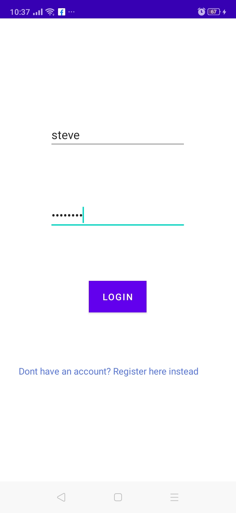
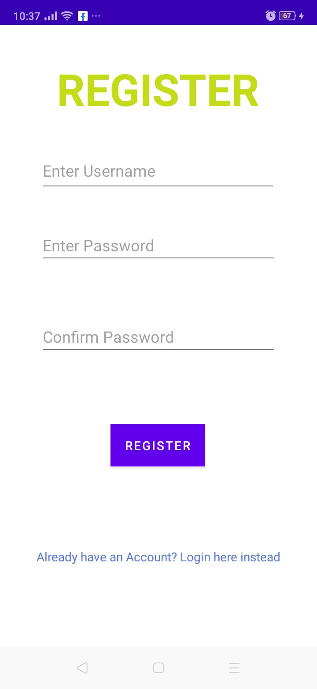
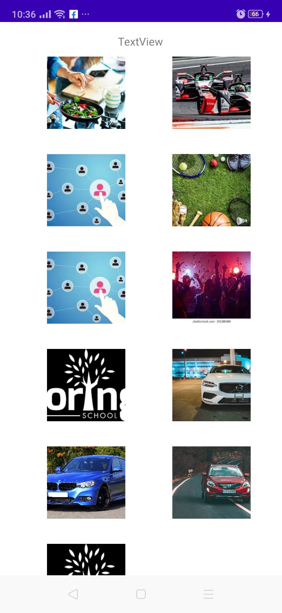

## Nyaranga Social App
#### This is an app that connects individuals around the globe. Makes the world a global village.a

##ScreenShots

## Setup And Intallation
For users, just download the app on your Android device and you are good to go.a
For developers, clone the app from the following link https://github.com/JAPHETHNYARANGA/nyaranga-social-app.git and open it in intellij or Android studio

##Technologies

* Android Os
* Java

# Contact
email the developer on nyaranga4@gmail.com.a

## License
this project is under MIT license

